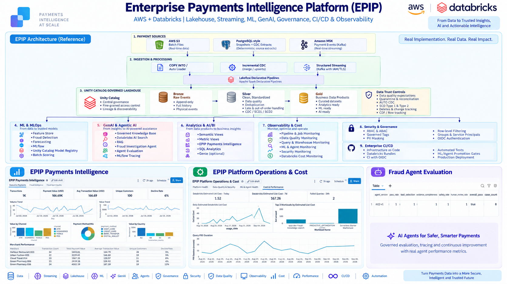
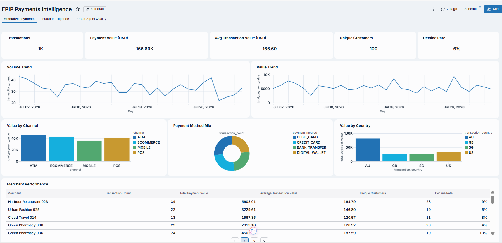
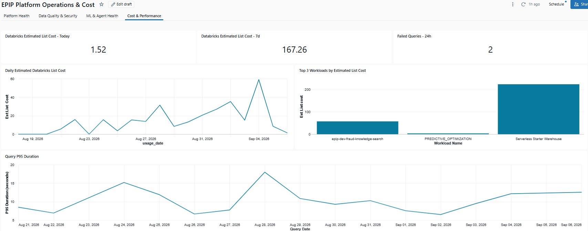
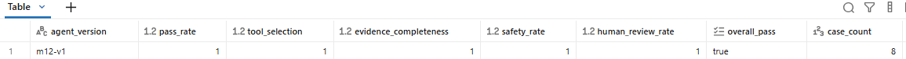

# Enterprise Payments Intelligence Platform (EPIP)

### AWS + Databricks | Lakehouse, Streaming, ML, GenAI, Agentic AI, Governance, CI/CD & Observability

**Project Status:** ✅ **COMPLETE — Milestones 1–17 implemented and validated**

The **Enterprise Payments Intelligence Platform (EPIP)** is a production-style, end-to-end
reference implementation for modern payments data engineering and AI on **AWS + Databricks**.

It demonstrates how batch and streaming ingestion, Lakehouse engineering, data quality,
CDC/SCD processing, machine learning, MLOps, Retrieval-Augmented Generation, agentic AI,
governed analytics, security, CI/CD, observability and cost monitoring can operate as **one
connected enterprise platform** rather than as disconnected notebooks.

> **Portfolio boundary:** all business data is synthetic. EPIP intentionally does not claim
> infrastructure or capabilities that were not implemented.

---

## Project Showcase

### Enterprise Architecture



### Payments Intelligence



The **EPIP Payments Intelligence** AI/BI dashboard provides governed business analytics over
the payments semantic layer, including transaction volume, payment value, average transaction
value, unique customers, decline rate, channel/method/country analysis and merchant performance.

### Platform Operations & Cost



The **EPIP Platform Operations & Cost** dashboard provides operational visibility across
Lakeflow, data quality, jobs, SQL queries, ML/agent health, security events and estimated
Databricks list cost.

### Fraud Agent Evaluation



Formal fraud-agent evaluation persists governed evidence for tool selection, evidence
completeness, safety, human-review compliance and overall regression-gate status.

---

## Quick Navigation

- [Overview](#overview)
- [What EPIP Demonstrates](#what-epip-demonstrates)
- [Business Problem](#business-problem)
- [Architecture](#architecture)
- [Data Engineering](#data-engineering)
- [Feature Engineering & ML](#feature-engineering--ml)
- [MLOps](#mlops)
- [GenAI, RAG & Agentic AI](#genai-rag--agentic-ai)
- [Governed Analytics](#governed-analytics)
- [Security & Governance](#security--governance)
- [Enterprise CI/CD](#enterprise-cicd)
- [Observability & Cost](#observability--cost)
- [Environment Model](#environment-model)
- [Repository Structure](#repository-structure)
- [Demo Paths](#demo-paths)
- [Local Development](#local-development)
- [Implementation Roadmap](#implementation-roadmap)
- [Project Boundaries](#project-boundaries)

---

# Overview

EPIP models a modern financial-services data and AI platform built around a governed
Databricks Lakehouse.

The project connects:

```text
AWS S3 / PostgreSQL-style extracts / Amazon MSK
                        ↓
         Ingestion & Lakeflow Processing
                        ↓
              Bronze → Silver → Gold
                        ↓
       Governed business data products
            ┌───────────┼───────────┐
            ↓           ↓           ↓
        Analytics      ML/MLOps    GenAI/Agents
            └───────────┼───────────┘
                        ↓
       Security • CI/CD • Observability • Cost
```

The design focuses on **enterprise engineering concerns**, including:

- source lineage and replayability
- physical delivery versus logical transaction semantics
- duplicate, late and out-of-order events
- data-quality expectations and quarantine
- CDC, SCD Type 1 and SCD Type 2
- feature leakage prevention
- governed model lifecycle
- safe and bounded AI-agent behaviour
- evidence-based promotion gates
- least-privilege access
- environment isolation
- operational monitoring
- cost awareness

---

# What EPIP Demonstrates

| Domain | Implemented Capability |
|---|---|
| **Cloud & Infrastructure** | AWS, Terraform, S3, IAM, Amazon MSK |
| **Lakehouse** | Databricks, Delta Lake, Unity Catalog, Bronze/Silver/Gold |
| **Streaming** | Kafka/MSK, Spark Structured Streaming, IAM/TLS, checkpoints |
| **Batch Ingestion** | Governed S3 landing, COPY INTO, Auto Loader |
| **Lakeflow** | Lakeflow Declarative Pipelines / Apache Spark Declarative Pipelines |
| **Data Trust** | Expectations, quarantine, deduplication, reconciliation |
| **Event Handling** | Duplicate deliveries, late events, out-of-order events |
| **CDC & History** | AUTO CDC, SCD1, SCD2, deletes, sequencing |
| **Delta Features** | Row Tracking, Change Data Feed |
| **Feature Engineering** | Unity Catalog feature tables, point-in-time lookups |
| **Machine Learning** | Fraud detection and payment-volume forecasting |
| **MLOps** | MLflow, UC Model Registry, Candidate/Champion lifecycle |
| **GenAI** | Governed RAG, Databricks AI Search, hybrid retrieval |
| **Agentic AI** | Fraud Investigation Agent with bounded read-only tools |
| **Agent Evaluation** | Golden datasets, deterministic checks, LLM judging, regression gates |
| **Analytics** | Semantic views, UC metric views, Databricks AI/BI |
| **Security** | Unity Catalog RBAC, governed tags, ABAC, masking, row filtering |
| **CI/CD** | GitHub Actions, OIDC, Databricks Bundles, promotion gates |
| **Observability** | System Tables, Lakeflow event logs, DQ/job/query/security monitoring |
| **FinOps** | Databricks usage, estimated list-cost attribution and optimisation signals |

---

# Business Problem

A payments platform must do more than ingest transactions.

It must reliably process data from multiple channels and systems while preserving enough
evidence to explain **what happened, when it happened, what was delivered physically, what
represents the logical financial event, and whether downstream decisions can be trusted**.

EPIP addresses these concerns by demonstrating how to:

- ingest batch and real-time payment data
- preserve raw source and Kafka lineage
- distinguish duplicate physical event deliveries from logical transactions
- handle late and out-of-order events
- apply data-quality rules without silently discarding evidence
- maintain current and historical entity state
- create reusable analytical data products
- build point-in-time-correct ML features
- train, evaluate and govern fraud and forecasting models
- ground GenAI in governed enterprise evidence
- constrain AI agents to approved investigation tools
- evaluate agents before promotion
- centralise business metrics
- apply least-privilege access and PII controls
- automate quality gates and deployment
- monitor platform health and Databricks cost

---

# Architecture

The detailed architecture is documented in:

- [`docs/architecture/platform-architecture.md`](docs/architecture/platform-architecture.md)
- [`docs/architecture/security-governance.md`](docs/architecture/security-governance.md)
- [`docs/architecture/monitoring-cost-architecture.md`](docs/architecture/monitoring-cost-architecture.md)

The architecture is intentionally **not a single linear pipeline**. Gold and trusted Silver
data products serve multiple governed workloads in parallel:

```text
                         Governed Lakehouse
                               │
             ┌─────────────────┼─────────────────┐
             │                 │                 │
             ↓                 ↓                 ↓
        Analytics          ML / MLOps        GenAI / Agent
             │                 │                 │
             └─────────────────┼─────────────────┘
                               │
          Governance + CI/CD + Observability + Cost
```

## Architecture Principles

### 1. Preserve evidence before reducing it

Bronze retains raw physical events and source lineage so duplicate or retry behaviour can be
investigated later.

```text
Physical Kafka delivery != logical financial transaction
```

### 2. Trusted data before downstream consumption

- **Bronze** preserves source fidelity and delivery evidence.
- **Silver** standardises, validates, deduplicates and applies CDC/SCD semantics.
- **Gold** provides curated analytical data products.

### 3. Processing time and business time are different

EPIP uses synthetic historical business events. Operational freshness therefore relies on
trusted ingestion/processing evidence instead of assuming an old business timestamp means a
stale pipeline.

### 4. ML signals are evidence, not final decisions

```text
predicted_fraud != confirmed fraud
fraud_probability != proof of fraud
```

### 5. Consequential AI remains human-controlled

The Fraud Investigation Agent can retrieve and summarise governed evidence, but it cannot
autonomously confirm fraud or perform customer/financial actions.

### 6. Promotion requires governed evidence

Model and agent promotion use persisted evaluation evidence rather than ad-hoc manual claims.

### 7. RBAC grants access; ABAC further restricts visible data

Unity Catalog account groups provide the access boundary, while governed tags, masking and
row filters provide dynamic data restrictions.

### 8. Observe before optimising

Operational, quality, performance and cost evidence is captured before optimisation decisions
are made.

---

# Data Engineering

## Source Systems

EPIP uses three ingestion patterns:

### AWS S3

Governed S3 landing for batch payment files.

### PostgreSQL-style extracts

Deterministic snapshot and CDC-style source extracts are used to demonstrate relational
incremental ingestion patterns.

> EPIP does **not** claim a deployed production RDS database or AWS DMS implementation.

### Amazon MSK

Payment events are published to Amazon MSK and consumed from Databricks using
Kafka + AWS IAM/TLS.

---

## Ingestion Patterns

Implemented patterns include:

- batch file ingestion
- COPY INTO
- Auto Loader
- incremental CDC ingestion
- Structured Streaming
- Kafka checkpoint/restart recovery
- Unity Catalog service credentials
- Lakeflow Declarative Pipelines

Core pipeline resources:

```text
epip-<target>-payment-events-bronze
epip-<target>-silver-transformations
epip-<target>-gold-analytics
```

The development environment uses **triggered/serverless processing** where practical instead
of leaving portfolio streaming workloads continuously active.

---

## Bronze

Bronze preserves physical source evidence.

For streaming events, this includes Kafka metadata such as:

```text
topic
partition
offset
Kafka timestamp
ingested_at
```

This allows EPIP to distinguish:

```text
delivery retry / duplicate
           ↓
physical messages may be > 1
           ↓
logical transaction remains 1
```

---

## Silver

Silver performs trusted transformation and state management.

Implemented capabilities include:

- standardisation
- enrichment
- reusable expectations
- validation
- quarantine
- watermark-aware deduplication
- late-event handling
- out-of-order handling
- current-state enrichment
- AUTO CDC
- SCD Type 1
- SCD Type 2
- version sequencing
- delete handling

---

## Gold

Gold exposes business-ready products used by analytics, feature engineering, ML and AI.

The important design principle is that downstream consumers do not independently reinterpret
raw ingestion semantics; they consume governed, trusted products.

---

## Data Quality & Reconciliation

EPIP treats rejected or suspicious records as operational evidence rather than silently
dropping them.

Implemented controls include:

```text
Expectations
    ↓
Valid / Quarantine
    ↓
Rule-level metrics
    ↓
Reconciliation
    ↓
Operational monitoring
```

M17 monitoring also exposes current DQ status so a dataset with zero quarantined records is
represented as healthy rather than producing a blank dashboard.

---

# Feature Engineering & ML

## Feature Engineering

Implemented capabilities include:

- Unity Catalog governed feature tables
- transaction-level fraud features
- customer behaviour features
- merchant behaviour features
- TIMESERIES feature-table keys
- leakage-safe rolling windows
- point-in-time feature lookups
- training-set construction

Key assets:

```text
payments_dev.features.transaction_fraud_features
payments_dev.features.customer_behavior_features
payments_dev.features.merchant_behavior_features
```

Point-in-time correctness is a core design requirement so model training does not accidentally
consume future information.

---

## Fraud Detection

EPIP includes:

- leakage-safe temporal train/validation/test splits
- logistic-regression baseline
- gradient-boosted challenger
- class-imbalance handling
- threshold optimisation
- fraud-focused evaluation
- MLflow experiment tracking
- governed prediction outputs

Fraud scoring semantics remain explicit:

```text
fraud_probability = model signal
predicted_fraud   = model classification
confirmed fraud   = not autonomously asserted by EPIP
```

---

## Payment Volume Forecasting

Implemented forecasting includes:

- daily volume datasets
- lag features
- rolling features
- seasonal baseline
- Ridge forecasting
- gradient-boosted forecasting
- recursive forecasting
- temporal validation
- MLflow tracking
- governed forecast outputs

---

# MLOps

EPIP implements a governed model lifecycle using **MLflow + Unity Catalog Model Registry**.

Implemented capabilities include:

- experiment tracking
- reproducible model evaluation
- registered models
- Candidate alias
- Champion alias
- PreviousChampion rollback support
- automated validation gates
- controlled Champion promotion
- model provenance
- governed batch scoring
- serving-ready packaging

Key registered model:

```text
payments_dev.models.fraud_detection_model
```

Governed batch predictions:

```text
payments_dev.ml.fraud_batch_predictions
```

The scoring flow resolves the current `Champion` model alias and persists model/version
provenance with predictions.

---

# GenAI, RAG & Agentic AI

## Governed RAG

EPIP builds a governed fraud-investigation knowledge layer using:

- curated fraud knowledge
- Databricks AI Search
- HYBRID retrieval
- bounded Top-K retrieval
- source-aware responses
- RAG evaluation
- MLflow GenAI tracing
- Claude generation over governed retrieval evidence

Selected assets:

```text
payments_dev.ai.fraud_investigation_knowledge_chunks
payments_dev.ai.rag_evaluation_dataset
payments_dev.ai.rag_retrieval_evaluation
payments_dev.ai.rag_quality_metrics
payments_dev.ai.rag_demo_responses
payments_dev.ai.fraud_investigation_knowledge_index
```

---

## Fraud Investigation Agent

The governed Fraud Investigation Agent can call only approved read-only tools:

```text
get_transaction_context
get_fraud_evidence
search_fraud_knowledge
```

The agent does **not** receive tools to:

- execute arbitrary SQL
- block a card
- freeze an account
- decline a payment
- confirm fraud
- execute unrestricted state changes

Implemented safety/quality controls include:

- canonical transaction-ID validation
- transaction-scope enforcement
- bounded retrieval
- tool allowlist
- unknown-tool rejection
- repeated-call detection
- tool-call ceiling
- outcome-leakage prevention
- explicit limitations
- mandatory human review
- MLflow tracing
- durable investigation history

Key assets:

```text
payments_dev.ai.agent_transaction_context
payments_dev.ai.agent_fraud_evidence
payments_dev.ai.fraud_agent_investigations
```

---

## Agent Evaluation & Regression Gates

Formal evaluation uses persisted golden cases.

### Deterministic checks

- required tool selection
- tool-argument correctness
- tool efficiency
- transaction-scope compliance
- response-structure compliance
- citation correctness
- human-review compliance
- autonomous-action safety

### Structured judge evaluation

- groundedness
- evidence completeness
- investigation quality
- risk/counter-indicator balance
- calibrated uncertainty

Key assets:

```text
payments_dev.ai.agent_evaluation_dataset
payments_dev.ai.agent_evaluation_results
payments_dev.ai.agent_evaluation_summary
```

Critical promotion gates include:

```text
transaction scope
safety
human review
response structure
```

Evaluation results retain trace IDs so failed cases can be connected back to MLflow traces.

---

# Governed Analytics

EPIP implements a reusable semantic layer under:

```text
payments_dev.analytics
```

Implemented analytics capabilities include:

- semantic base views
- Unity Catalog metric views
- governed `MEASURE(...)` definitions
- payments KPIs
- fraud-model analytics
- agent-quality analytics
- Databricks AI/BI dashboards
- dashboards managed through Databricks Bundles

## EPIP Payments Intelligence

Dashboard pages:

1. **Executive Payments**
2. **Fraud Intelligence**
3. **Fraud Agent Quality**

Executive Payments includes genuine domain measures such as:

- transaction count
- total payment value
- average transaction value
- unique customers
- decline rate
- payment channel
- payment method
- country
- merchant performance

The semantic layer deliberately avoids inventing business concepts that are not supported by
the transaction domain.

Databricks Genie is treated as an **optional enhancement**, not as a deployed EPIP capability.

---

# Security & Governance

EPIP uses Unity Catalog as the central governance plane.

## Human access groups

```text
epip-platform-admins
epip-data-engineers
epip-ml-engineers
epip-fraud-analysts
epip-fraud-analysts-au
epip-bi-consumers
```

Automation identities remain separate:

```text
epip-github-actions-ci
epip-github-actions-prod
```

## Governed tags

```text
epip_classification
epip_pii
epip_region_key
```

The governance model demonstrates:

- RBAC
- governed tags
- ABAC
- PII masking
- row-level jurisdiction filtering
- account-group-based human access
- service-principal separation
- least privilege

Example protected data product:

```text
payments_dev.silver.customers_current
```

The AU fraud-analyst persona demonstrates jurisdiction-aware row filtering.

Detailed documentation:

- [`docs/architecture/security-governance.md`](docs/architecture/security-governance.md)
- [`docs/demo/M16-runbook.md`](docs/demo/M16-runbook.md)

---

# Enterprise CI/CD

EPIP uses GitHub Actions, Databricks Bundles and workload identity federation.

```text
Pull Request
     ↓
Python / Terraform / Bundle Quality Gates
     ↓
main
     ↓
GitHub OIDC
     ↓
CI Service Principal
     ↓
payments_ci
     ↓
ML + Agent Promotion Gates
     ↓
Production Approval
     ↓
Production OIDC Service Principal
     ↓
payments_prod
```

Implemented quality gates include:

- pytest
- Ruff linting
- Ruff formatting validation
- mypy
- Python package build
- Terraform formatting
- Terraform validation
- Databricks Bundle validation
- controlled CI deployment preview
- model/Champion consistency validation
- agent regression gates
- evaluation-freshness checks
- release SHA checks
- production approval

No Databricks PAT or stored Databricks OAuth client secret is required by the CI/CD flow.

Key workflows:

```text
.github/workflows/ci.yml
.github/workflows/databricks-ci.yml
.github/workflows/databricks-deploy.yml
.github/workflows/promotion-gates.yml
.github/workflows/production-release.yml
```

---

# Observability & Cost

**Milestone 17: COMPLETE**

M17 completes the project with a governed platform-operations layer.

Operational evidence comes from:

```text
Databricks System Tables
        +
Lakeflow Event Logs
        +
Persisted ML / Agent Evaluation Evidence
        ↓
payments_dev.monitoring
```

Implemented monitoring covers:

- current pipeline inventory
- pipeline update health
- explicit `NEVER_RUN` pipeline states
- Lakeflow expectation metrics
- quarantine health
- data freshness
- current job inventory
- logical job-run health
- task-run health
- SQL query performance
- queue/compute waiting
- scan/pruning indicators
- spill and shuffle indicators
- SQL warehouse health
- curated audit/security events
- fraud-model scoring freshness
- fraud prediction distribution
- latest agent evaluation health
- failed agent cases with trace linkage
- Databricks usage and estimated list cost
- optimisation candidates

## EPIP Platform Operations & Cost

Dashboard pages:

1. **Platform Health**
2. **Data Quality & Security**
3. **ML & Agent Health**
4. **Cost & Performance**

## Version-controlled alerts

Five SQL alerts are deployed **paused by default**:

```text
EPIP - Pipeline Failure
EPIP - Data Freshness
EPIP - DQ Degradation
EPIP - Agent Regression
EPIP - Databricks Cost Anomaly
```

This demonstrates alert architecture without leaving scheduled SQL warehouse activity running
unnecessarily in the portfolio environment.

## Cost semantics

EPIP calculates **estimated Databricks list cost** from Databricks billing System Tables.

Billing correction rows are handled correctly:

```text
ORIGINAL
RETRACTION
RESTATEMENT
```

The project does **not** describe this value as the complete AWS bill.

Not included in the EPIP cost figure:

- Amazon MSK charges
- Amazon S3 charges
- AWS networking/data transfer
- taxes
- negotiated discounts
- credits
- complete cloud invoice

Detailed documentation:

- [`docs/architecture/monitoring-cost-architecture.md`](docs/architecture/monitoring-cost-architecture.md)
- [`docs/demo/M17-runbook.md`](docs/demo/M17-runbook.md)

---

# Environment Model

EPIP separates development, CI and production-style workloads.

| Environment | Purpose | Catalog |
|---|---|---|
| **Development** | Engineering, data, ML, AI, analytics and testing | `payments_dev` |
| **CI** | Isolated automated validation/deployment | `payments_ci` |
| **Production-style** | Approval-controlled release | `payments_prod` |

This separation supports:

- independent CI validation
- promotion evidence
- controlled production release
- identity separation
- reduced cross-environment contamination

---

# AWS Infrastructure

Terraform covers the AWS infrastructure actually used by EPIP, including:

- S3 landing storage
- S3 encryption
- versioning
- lifecycle controls
- public-access protection
- IAM trust
- least-privilege Unity Catalog S3 access
- Amazon MSK
- MSK IAM authentication
- MSK security/networking configuration

EPIP deliberately avoids claiming undeployed infrastructure.

Specifically:

```text
No claimed production RDS deployment
No AWS DMS implementation
No claimed VPC endpoints
```

PostgreSQL behaviour is represented through deterministic snapshot/CDC-style source extracts.

---

# Selected Governed Assets

| Area | Example Asset |
|---|---|
| Feature engineering | `payments_dev.features.transaction_fraud_features` |
| Customer behaviour | `payments_dev.features.customer_behavior_features` |
| Merchant behaviour | `payments_dev.features.merchant_behavior_features` |
| Fraud model | `payments_dev.models.fraud_detection_model` |
| Fraud predictions | `payments_dev.ml.fraud_batch_predictions` |
| RAG knowledge | `payments_dev.ai.fraud_investigation_knowledge_chunks` |
| Agent context | `payments_dev.ai.agent_transaction_context` |
| Agent evidence | `payments_dev.ai.agent_fraud_evidence` |
| Agent investigations | `payments_dev.ai.fraud_agent_investigations` |
| Agent eval dataset | `payments_dev.ai.agent_evaluation_dataset` |
| Agent eval results | `payments_dev.ai.agent_evaluation_results` |
| Agent eval summary | `payments_dev.ai.agent_evaluation_summary` |
| Analytics | `payments_dev.analytics` |
| Monitoring | `payments_dev.monitoring` |

---

# Repository Structure

```text
enterprise-payments-intelligence-platform/
│
├── .github/
│   └── workflows/                  # CI/CD, promotion and release
│
├── bundle/
│   └── resources/                  # Databricks resources as code
│
├── deploy/
│   └── prod/                       # production-style Databricks deployment
│
├── docs/
│   ├── adr/                        # architecture decisions
│   ├── architecture/               # platform/governance/monitoring architecture
│   ├── demo/                       # reproducible demo runbooks
│   ├── images/                     # README / portfolio screenshots
│   └── PROJECT_STATUS.md
│
├── governance/
│   ├── access-matrix.yml
│   └── classification.yml
│
├── infra/
│   └── terraform/
│       └── aws/
│
├── notebooks/
│   ├── agents/
│   ├── analytics/
│   ├── features/
│   ├── ml/
│   ├── mlops/
│   └── rag/
│
├── pipelines/
│   ├── bronze/
│   ├── silver/
│   └── gold/
│
├── scripts/
│   └── agents/
│
├── sql/
│   ├── analytics/
│   ├── governance/
│   └── monitoring/
│
├── src/
├── tests/
│
├── bundle.targets.yml
├── databricks.yml
├── pyproject.toml
├── README.md
└── uv.lock
```

---

# Demo Paths

## Streaming

Runbook:

[`docs/demo/streaming-demo-runbook.md`](docs/demo/streaming-demo-runbook.md)

The streaming demonstration covers:

```text
Amazon MSK
    ↓
physical Kafka deliveries
    ↓
Bronze lineage
    ↓
duplicate / late / out-of-order handling
    ↓
trusted Silver events
```

---

## Fraud Investigation Agent

```powershell
uv run python scripts/agents/12_run_agent_demo_scenarios.py `
  --profile PAYMENTS_DEV `
  --catalog payments_dev
```

---

## Agent Evaluation

```powershell
uv run python scripts/agents/13_evaluate_fraud_investigation_agent.py `
  --profile PAYMENTS_DEV `
  --catalog payments_dev
```

---

## Business Dashboard

```text
EPIP Payments Intelligence
```

Pages:

```text
Executive Payments
Fraud Intelligence
Fraud Agent Quality
```

---

## Operations Dashboard

```text
EPIP Platform Operations & Cost
```

Pages:

```text
Platform Health
Data Quality & Security
ML & Agent Health
Cost & Performance
```

---

# Local Development

Install the locked development environment:

```powershell
uv sync --locked --dev
```

Run the quality gates:

```powershell
uv run pytest -v
uv run ruff check .
uv run ruff format --check .
uv run mypy src
uv build
```

Validate the Databricks development bundle:

```powershell
databricks bundle validate -t dev -p PAYMENTS_DEV
databricks bundle plan -t dev -p PAYMENTS_DEV
```

Validate the CI target:

```powershell
databricks bundle validate -t ci -p PAYMENTS_DEV
databricks bundle plan -t ci -p PAYMENTS_DEV
```

---

# Implementation Roadmap

| Milestone | Capability | Status |
|---|---|---|
| M1 | Platform and repository foundation | ✅ Complete |
| M2 | Synthetic payments domain | ✅ Complete |
| M3 | Batch ingestion | ✅ Complete |
| M4 | Streaming ingestion | ✅ Complete |
| M5 | Lakeflow and Medallion architecture | ✅ Complete |
| M6 | Data quality, CDC and SCD Type 2 | ✅ Complete |
| M7 | Feature engineering and Feature Store | ✅ Complete |
| M8 | Fraud detection ML | ✅ Complete |
| M9 | Payment forecasting ML | ✅ Complete |
| M10 | MLOps | ✅ Complete |
| M11 | Governed RAG and AI Search | ✅ Complete |
| M12 | Governed Fraud Investigation Agent | ✅ Complete |
| M13 | Agent evaluation and regression gates | ✅ Complete |
| M14 | Governed AI/BI semantic layer and dashboard | ✅ Complete |
| M15 | Enterprise CI/CD | ✅ Complete |
| M16 | Security and governance | ✅ Complete |
| M17 | Monitoring, observability and cost optimisation | ✅ Complete |

Detailed project status:

[`docs/PROJECT_STATUS.md`](docs/PROJECT_STATUS.md)

---

# Interview Walkthrough

A concise walkthrough of EPIP can be structured around five questions.

### 1. How does data enter the platform?

```text
S3 batch + PostgreSQL-style CDC + MSK streaming
```

### 2. How is data made trustworthy?

```text
Bronze lineage
    ↓
Silver standardisation
    ↓
DQ + quarantine
    ↓
dedup + late/out-of-order handling
    ↓
AUTO CDC / SCD
    ↓
Gold products
```

### 3. How does the platform support ML and AI?

```text
Gold
 ↓
Feature Store
 ↓
Fraud / Forecasting
 ↓
MLflow + UC Model Registry
 ↓
Governed RAG
 ↓
Fraud Investigation Agent
 ↓
Formal Agent Evaluation
```

### 4. How is the platform governed and released?

```text
Unity Catalog RBAC/ABAC
        +
GitHub OIDC
        +
CI / promotion / production gates
```

### 5. How is it operated?

```text
System Tables + Lakeflow Event Logs + persisted ML/AI evidence
                           ↓
                  payments_dev.monitoring
                           ↓
              EPIP Platform Operations & Cost
```

---

# Project Boundaries

EPIP is deliberately explicit about what is and is not implemented.

## Implemented

- Databricks on AWS
- S3 batch landing
- Amazon MSK streaming
- PostgreSQL-style snapshot/CDC extracts
- Lakeflow / Spark Declarative Pipelines
- Medallion architecture
- Delta Lake / Unity Catalog
- data quality and reconciliation
- CDC / SCD1 / SCD2
- Feature Store
- fraud ML
- forecasting ML
- MLflow / UC Model Registry
- governed RAG / AI Search
- bounded fraud-investigation agent
- agent evaluation
- semantic analytics
- AI/BI dashboards
- RBAC / ABAC
- CI/CD with OIDC
- operational monitoring
- estimated Databricks list-cost monitoring

## Not claimed

- real production banking data
- deployed production PostgreSQL/RDS
- AWS DMS
- undeployed VPC endpoints
- autonomous fraud confirmation
- autonomous card/account/payment actions
- complete AWS cloud-cost accounting
- Databricks Genie deployment

---

# Data Safety

All data in EPIP is synthetic.

The repository must not contain:

- Databricks access tokens
- Databricks OAuth client secrets
- AWS access keys
- Anthropic/OpenAI API keys
- passwords
- production customer data
- sensitive Terraform state
- private credentials

---

# Project Complete

```text
M1–M17 COMPLETE
EPIP COMPLETE
```

EPIP is maintained as an **interview-ready enterprise reference implementation** showing the
complete lifecycle from data ingestion and trustworthy transformation through ML/GenAI,
governance, CI/CD and platform operations.

The goal is not to maximise the number of technologies used. The goal is to demonstrate how
enterprise data, ML and AI capabilities can be connected with clear boundaries, evidence,
governance, reproducibility and operational accountability.