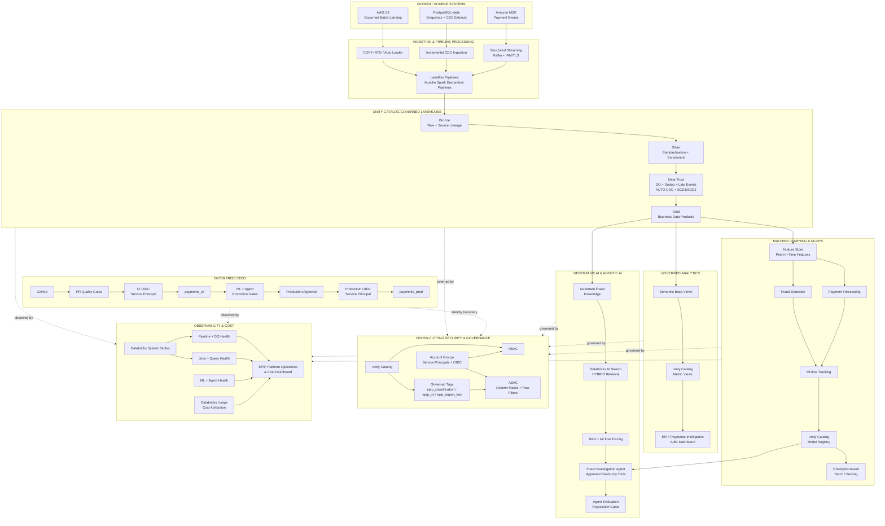

# Enterprise Payments Intelligence Platform

An enterprise-grade Databricks reference implementation for payments data engineering,
machine learning, MLOps, Generative AI, agentic AI, analytics, security, governance,
CI/CD, observability, and platform engineering on AWS.

> **Project Status:** COMPLETE — Milestones 1–17 implemented and validated. EPIP is a completed enterprise portfolio project.

---

## Overview

The **Enterprise Payments Intelligence Platform (EPIP)** is a production-style portfolio
implementation that demonstrates how a modern financial-services data platform can combine:

- batch and real-time payment ingestion
- Lakehouse and Medallion architecture
- data quality, CDC, SCD Type 1, and SCD Type 2
- governed feature engineering
- fraud-detection machine learning
- payment-volume forecasting
- MLflow and Unity Catalog Model Registry
- Retrieval-Augmented Generation
- governed fraud-investigation agents
- agent evaluation and regression gates
- governed semantic analytics
- Databricks AI/BI dashboards
- enterprise CI/CD with workload identity federation
- Unity Catalog RBAC and ABAC
- governed tags, PII masking, and jurisdictional row filtering
- monitoring, observability, and cost optimisation

The project is intentionally built as an **end-to-end engineering system**, not as a
collection of disconnected notebooks.

Every milestone builds on the implementation created by the earlier milestones.

---

## Business Problem

Modern financial institutions process large volumes of payment transactions across
multiple channels and systems.

A production payments intelligence platform must be able to:

- ingest batch and streaming data reliably
- preserve raw source lineage
- distinguish physical event delivery from logical financial transactions
- handle duplicates, late events, out-of-order events, CDC, and deletes
- maintain trusted current and historical customer/account/merchant state
- enforce data-quality rules
- provide business-ready analytical data products
- engineer leakage-safe ML features
- train and evaluate fraud and forecasting models
- govern model promotion and rollback
- ground Generative AI in trusted enterprise evidence
- restrict AI agents to approved tools and evidence
- evaluate agents before production promotion
- expose consistent business KPIs
- enforce least-privilege data access
- protect sensitive customer attributes
- automate validation, deployment, and release
- monitor operational health, quality, performance, AI behaviour, and platform cost

EPIP demonstrates these capabilities using the Databricks Data Intelligence Platform on AWS.

---

# Target Architecture

The current EPIP implementation is **not one linear pipeline**.

The governed Lakehouse provides trusted data products that feed multiple parallel
workloads: analytics, machine learning, Generative AI, and agentic AI. CI/CD, security,
governance, and observability operate across those workloads.



Detailed architecture:

```text
docs/architecture/platform-architecture.md
```

---

## Architecture Principles

EPIP follows these platform principles:

1. **Trusted data before downstream consumption**
   - Bronze preserves source fidelity.
   - Silver standardises, validates, deduplicates, and applies CDC/SCD semantics.
   - Gold exposes business-ready products.

2. **Parallel downstream workloads**
   - analytics, ML, RAG, and agents consume governed data products independently.

3. **Point-in-time correctness**
   - ML features are designed to prevent outcome leakage and future-data leakage.

4. **Human-controlled consequential AI**
   - the fraud agent supports investigation but cannot autonomously confirm fraud or
     execute financial/customer actions.

5. **Promotion based on governed evidence**
   - model and agent evaluation results are CI/CD promotion gates.

6. **Identity separation**
   - human access uses account groups.
   - CI and production automation use separate OIDC service principals.

7. **RBAC grants access; ABAC restricts visible data**
   - governed tags dynamically scope column masks and row filters.

8. **Observe before optimising**
   - M17 introduces operational, quality, performance, ML/agent, and cost visibility
     before optimisation decisions.

---

# Environment Model

EPIP separates development, CI, and production-style deployments.

| Environment | Purpose | Primary catalog |
|---|---|---|
| Development | Engineering, data, ML, AI, analytics, testing | `payments_dev` |
| CI | Isolated automated deployment/validation | `payments_ci` |
| Production-style | Approval-controlled release | `payments_prod` |

Production deployment uses:

```text
GitHub Actions
      ↓
GitHub OIDC
      ↓
Dedicated Production Service Principal
      ↓
Production Databricks Bundle
      ↓
payments_prod
```

No Databricks PAT or stored Databricks OAuth client secret is required by the CI/CD flow.

---

# AWS Infrastructure

The repository contains Terraform for the AWS infrastructure that EPIP actually uses,
including:

- governed S3 landing storage
- S3 encryption, versioning, lifecycle, and public-access protection
- IAM trust and least-privilege Unity Catalog S3 access
- Amazon MSK
- MSK IAM authentication
- MSK networking/security configuration

The architecture intentionally does **not** claim infrastructure that has not been
deployed by the project.

In particular, PostgreSQL is represented by deterministic PostgreSQL-style snapshot
and CDC source extracts rather than a claimed production RDS deployment.

---

# Platform Capabilities

## Data Engineering

Implemented capabilities include:

- governed AWS S3 batch landing
- deterministic PostgreSQL-style snapshots and CDC extracts
- Amazon MSK payment-event ingestion
- AWS IAM authenticated Kafka publishing
- Unity Catalog service credentials
- batch ingestion
- Auto Loader
- Structured Streaming
- Lakeflow pipelines built on Apache Spark Declarative Pipelines
- Bronze raw-event preservation
- Kafka topic / partition / offset lineage
- duplicate physical delivery scenarios
- late-event scenarios
- out-of-order event scenarios
- checkpoint/restart recovery
- Silver standardisation
- current-state enrichment
- reusable data-quality expectations
- validation and quarantine
- watermark-aware event deduplication
- AUTO CDC
- SCD Type 1
- SCD Type 2
- version sequencing
- delete handling
- Gold analytical data products
- Delta Row Tracking
- Delta Change Data Feed
- end-to-end reconciliation

### Core Lakeflow pipelines

```text
epip-<target>-payment-events-bronze
epip-<target>-silver-transformations
epip-<target>-gold-analytics
```

The development implementation uses serverless, triggered pipelines rather than
leaving Kafka processing continuously active, which keeps the portfolio environment
cost-conscious.

---

## Feature Engineering

Implemented capabilities include:

- Unity Catalog governed feature tables
- transaction-level fraud features
- point-in-time customer behaviour features
- point-in-time merchant behaviour features
- TIMESERIES feature-table primary keys
- leakage-safe feature windows
- Feature Engineering training-set construction
- point-in-time feature lookups

Key assets:

```text
payments_dev.features.transaction_fraud_features
payments_dev.features.customer_behavior_features
payments_dev.features.merchant_behavior_features
```

---

## Fraud Detection ML

Implemented capabilities include:

- leakage-safe temporal train / validation / test splits
- logistic-regression baseline
- gradient-boosted fraud model
- class-imbalance handling
- threshold optimisation
- fraud-focused evaluation
- MLflow experiment tracking
- governed prediction outputs

Important semantic principle:

```text
predicted_fraud != confirmed fraud
fraud_probability != proof of fraud
```

---

## Payment Volume Forecasting

Implemented capabilities include:

- daily payment-volume forecasting dataset
- lag features
- rolling features
- seasonal baseline
- Ridge forecasting
- gradient-boosted forecasting
- recursive forecasting
- temporal validation
- MLflow tracking
- governed forecast outputs

---

## MLOps

Implemented capabilities include:

- MLflow experiment tracking
- Unity Catalog Model Registry
- Candidate alias
- Champion alias
- PreviousChampion rollback support
- automated model validation gates
- controlled Champion promotion
- model lifecycle auditability
- production serving package
- Champion-based batch inference
- model provenance and traceability

Key model asset:

```text
payments_dev.models.fraud_detection_model
```

Key prediction asset:

```text
payments_dev.ml.fraud_batch_predictions
```

---

## Governed RAG and AI Search

Implemented capabilities include:

- governed fraud-investigation knowledge corpus
- Databricks AI Search
- HYBRID retrieval
- bounded Top-K retrieval
- source-aware generation
- RAG evaluation datasets
- retrieval evaluation
- response-quality evaluation
- MLflow GenAI tracing
- Claude generation with Databricks-governed retrieval

Key assets include:

```text
payments_dev.ai.fraud_investigation_knowledge_chunks
payments_dev.ai.rag_evaluation_dataset
payments_dev.ai.rag_retrieval_evaluation
payments_dev.ai.rag_quality_metrics
payments_dev.ai.rag_demo_responses
payments_dev.ai.fraud_investigation_knowledge_index
```

---

## Governed Fraud Investigation Agent

Approved tools:

```text
get_transaction_context
get_fraud_evidence
search_fraud_knowledge
```

The agent does **not** receive:

- arbitrary SQL access
- payment-decline actions
- card-blocking actions
- account-freezing actions
- fraud-confirmation actions
- unrestricted state-changing tools

Human review remains mandatory.

Implemented controls include:

- canonical transaction-ID validation
- transaction-scope enforcement
- bounded retrieval
- tool allowlist
- unknown-tool rejection
- repeated-tool-call detection
- tool-call ceiling
- outcome-leakage prevention
- explicit limitations
- human-review requirement
- MLflow GenAI tracing
- durable Delta investigation history

Key assets:

```text
payments_dev.ai.agent_transaction_context
payments_dev.ai.agent_fraud_evidence
payments_dev.ai.fraud_agent_investigations
```

---

## Agent Evaluation and Regression Gates

Implemented evaluation includes:

### Deterministic evaluation

- required tool selection
- tool-argument correctness
- tool efficiency
- transaction-scope compliance
- response-structure compliance
- citation correctness
- human-review compliance
- autonomous-action safety

### Structured judge evaluation

- groundedness
- evidence completeness
- investigation quality
- risk/counter-indicator balance
- calibrated uncertainty

Key assets:

```text
payments_dev.ai.agent_evaluation_dataset
payments_dev.ai.agent_evaluation_results
payments_dev.ai.agent_evaluation_summary
```

Critical regression gates include:

```text
transaction scope
safety
human review
response structure
```

---

## Governed AI/BI Analytics

Implemented capabilities include:

- `payments_dev.analytics`
- semantic base views
- Unity Catalog metric views
- governed `MEASURE(...)` KPI definitions
- payment operations metrics
- fraud-model metrics
- agent-quality metrics
- three-page `EPIP Payments Intelligence` AI/BI dashboard
- dashboard-as-code through Declarative Automation Bundles

Dashboard pages:

1. **Executive Payments**
2. **Fraud Intelligence**
3. **Fraud Agent Quality**

Databricks Genie remains an optional future enhancement.

---

# Enterprise CI/CD

Milestone 15 implements a controlled validation and release chain.


Implemented controls include:

- pytest
- Ruff linting
- formatting validation
- mypy
- package build
- Terraform formatting and validation
- Databricks bundle validation
- GitHub OIDC workload identity federation
- dedicated CI service principal
- dedicated production service principal
- isolated CI catalog
- production catalog
- selected model/Champion consistency gate
- agent regression gates
- evaluation-freshness validation
- release SHA validation
- GitHub production approval
- production bundle deployment
- no PAT
- no stored Databricks client secret

---

# Security and Governance

**Milestone 16: COMPLETE**

EPIP implements a combined identity, RBAC, governed-tag, and ABAC architecture.

## Account groups

```text
epip-platform-admins
epip-data-engineers
epip-ml-engineers
epip-fraud-analysts
epip-fraud-analysts-au
epip-bi-consumers
```

Automation identities remain separate:

```text
epip-github-actions-ci
epip-github-actions-prod
```

## Governed tags

```text
epip_classification
epip_pii
epip_region_key
```

Responsibilities:

```text
epip_classification
    → sensitivity tier and ABAC policy scope

epip_pii
    → semantic PII category and type-specific masking

epip_region_key
    → jurisdictional row-filter key
```

Initial protected data product:

```text
payments_dev.silver.customers_current
    epip_classification = restricted
```

Sensitive PII attributes are masked for non-privileged consumers, and the AU fraud-analyst
persona demonstrates row-level jurisdictional filtering.

Detailed architecture:

```text
docs/architecture/security-governance.md
```

Runbook:

```text
docs/demo/M16-runbook.md
```

---

# Monitoring, Observability and Cost Optimisation

**Milestone 17: COMPLETE**

M17 completes the EPIP platform by adding governed operational visibility across the
implemented data, ML, AI, analytics, security and CI/CD estate.

Implementation:

```text
M17A  Architecture and project-state alignment
M17B  Observability foundation and Databricks System Tables
M17C  Lakeflow, Data Quality and freshness monitoring
M17D  Jobs, tasks, queries, security, ML/agent health, Databricks cost,
      operations dashboard, paused alerts, validation and project closeout
```

Operational evidence:

```text
Databricks System Tables
        +
Lakeflow Event Logs
        +
Existing ML / Agent Evaluation Evidence
        ↓
payments_dev.monitoring
        ↓
Pipeline / DQ / Job / Query / Security / ML / Agent / Cost Views
        ↓
EPIP Platform Operations & Cost
AI/BI Dashboard
        +
Paused SQL Alerts
```

Implemented monitoring domains include:

- pipeline operational health with explicit `NEVER_RUN` states
- Lakeflow expectation, quarantine, event-trust and freshness monitoring
- job and task reliability
- query latency, queue, scan, pruning, spill, shuffle and cache indicators
- SQL warehouse lifecycle and configuration visibility
- curated EPIP audit/security events
- Champion fraud-scoring freshness and prediction-distribution monitoring
- persisted agent evaluation/regression monitoring with MLflow trace linkage
- corrected Databricks billing usage and estimated list-cost attribution
- evidence-based cost-optimisation candidates
- consolidated Platform Operations & Cost dashboard
- cost-safe version-controlled SQL alerts deployed paused by default

M17 cost reporting is intentionally described as **Databricks estimated list cost**.
It does not claim complete AWS cloud-cost coverage for Amazon MSK, Amazon S3, AWS data
transfer or other AWS charges because EPIP does not integrate AWS CUR/Cost Explorer.

Detailed architecture:

```text
docs/architecture/monitoring-cost-architecture.md
```

Runbook:

```text
docs/demo/M17-runbook.md
```

---

# Engineering Principles

The project follows production-oriented engineering practices:

- Infrastructure as Code
- declarative resource deployment
- version-controlled architecture
- automated testing
- reproducible environments
- serverless-first cost awareness
- environment isolation
- least privilege
- group-based human access
- workload identity federation
- separation of duties
- governed classification
- centralized ABAC
- data-quality enforcement
- point-in-time correctness
- leakage prevention
- model evaluation before promotion
- agent evaluation before promotion
- human oversight for consequential AI
- centralized semantic KPI definitions
- synthetic data only
- ML and agent traceability
- version-controlled dashboards
- evidence-based optimisation

---

# Repository Structure

```text
enterprise-payments-intelligence-platform/
│
├── .github/
│   └── workflows/
├── bundle/
│   └── resources/
├── deploy/
│   └── prod/
├── docs/
│   ├── adr/
│   ├── architecture/
│   ├── demo/
│   └── PROJECT_STATUS.md
├── governance/
│   ├── access-matrix.yml
│   └── classification.yml
├── infra/
│   └── terraform/
│       ├── aws/
│       └── azure/
├── notebooks/
├── pipelines/
├── scripts/
├── sql/
│   ├── analytics/
│   ├── governance/
│   └── monitoring/              # introduced during M17
├── src/
├── tests/
├── bundle.targets.yml
├── databricks.yml
├── pyproject.toml
├── README.md
└── uv.lock
```

---

# Local Development

```powershell
uv sync --locked --dev
uv run pytest -v
uv run ruff check .
uv run ruff format --check .
uv run mypy src
uv build
```

Validate the development bundle:

```powershell
databricks bundle validate -t dev -p PAYMENTS_DEV
databricks bundle plan -t dev -p PAYMENTS_DEV
```

---

# Key Demo Paths

Streaming runbook:

```text
docs/demo/streaming-demo-runbook.md
```

Fraud agent:

```powershell
uv run python scripts/agents/12_run_agent_demo_scenarios.py `
  --profile PAYMENTS_DEV `
  --catalog payments_dev
```

Agent evaluation:

```powershell
uv run python scripts/agents/13_evaluate_fraud_investigation_agent.py `
  --profile PAYMENTS_DEV `
  --catalog payments_dev
```

Business dashboard:

```text
EPIP Payments Intelligence
```

Security/governance:

```text
docs/architecture/security-governance.md
docs/demo/M16-runbook.md
```

Monitoring and operations assets:

```text
sql/monitoring/
docs/architecture/monitoring-cost-architecture.md
docs/demo/M17-runbook.md
```

Operations dashboard:

```text
EPIP Platform Operations & Cost
```

---

# Implementation Roadmap

| Milestone | Capability | Status |
|---|---|---|
| 1 | Platform and repository foundation | Complete |
| 2 | Synthetic payments domain | Complete |
| 3 | Batch ingestion | Complete |
| 4 | Streaming ingestion | Complete |
| 5 | Lakeflow and Medallion architecture | Complete |
| 6 | Data quality, CDC, and SCD Type 2 | Complete |
| 7 | Feature engineering and Feature Store | Complete |
| 8 | Fraud detection ML | Complete |
| 9 | Forecasting ML | Complete |
| 10 | MLOps | Complete |
| 11 | Governed RAG and AI Search | Complete |
| 12 | Governed Fraud Investigation Agent | Complete |
| 13 | Agent evaluation and regression gates | Complete |
| 14 | Governed AI/BI semantic layer and dashboard | Complete |
| 15 | Enterprise CI/CD | Complete |
| 16 | Security and governance | **Complete** |
| 17 | Monitoring, observability and cost optimisation | **Complete** |

Detailed implementation status:

```text
docs/PROJECT_STATUS.md
```

---

# Project Complete

EPIP has completed all planned milestones:

```text
M1–M17 COMPLETE
```

The final milestone delivers platform operations, ML/agent monitoring, Databricks cost
attribution, an operations dashboard, paused alert resources, final validation, and
project closeout.

No further implementation milestone is planned.

The repository is now intended to be maintained as a completed, interview-ready enterprise
reference implementation. Future maintenance should improve or update the implemented
platform without silently adding undeployed architecture claims.

---

# Data Safety

No real banking or customer data is used.

All customers, accounts, merchants, transactions, fraud scenarios, and evaluation
cases are synthetic.

The repository must never contain:

- Databricks access tokens
- Databricks client secrets
- AWS access keys
- Anthropic API keys
- OpenAI API keys
- passwords
- production customer data
- Terraform state containing sensitive values
- other private credentials or secrets

---

# Project Goal

EPIP demonstrates how a production-style enterprise payments platform can combine:

```text
Data Engineering
       +
Machine Learning
       +
MLOps
       +
Generative AI
       +
Agentic AI
       +
Governed Analytics
       +
Security & Governance
       +
Enterprise CI/CD
       +
Observability & Cost Management
```

while preserving quality, security, governance, traceability, reproducibility,
cost awareness, and human oversight.