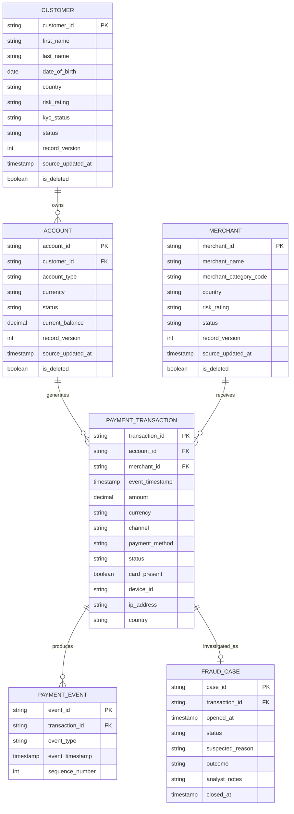

# Payments Domain Model

## Purpose

This document defines the canonical business entities used by the Enterprise Payments
Intelligence Platform.

These entities form the shared contract between synthetic source systems, Databricks
ingestion pipelines, machine learning workloads, analytics, and AI applications.

---

## Domain Model



---

## Source-System Mapping

| Entity | Planned Source | Ingestion Pattern |
|---|---|---|
| Customer | PostgreSQL | Snapshot / CDC |
| Account | PostgreSQL | Snapshot / CDC |
| Merchant | PostgreSQL | Snapshot / CDC |
| Historical Payment Transactions | Amazon S3 | Auto Loader |
| Payment Events | Kafka / Amazon MSK | Structured Streaming |
| Fraud Cases | PostgreSQL | Incremental / CDC |

---

## CDC and SCD Type 2 Candidates

The following master-data entities are expected to change over time:

- Customer
- Account
- Merchant

Each contains:

```text
record_version
source_updated_at
is_deleted
```

These fields will later support deterministic sequencing for CDC and SCD Type 2
processing.

Example customer history:

```text
cust-100
    |
    +-- version 1
    |      address = Melbourne
    |
    +-- version 2
           address = Sydney
```

The Silver customer dimension will later preserve both versions using SCD Type 2.

---

## Fraud Label Design

Fraud labels are deliberately not stored directly inside payment transactions.

Instead:

```text
Payment Transaction
        |
        v
Fraud Investigation
        |
        v
Fraud Case Outcome
        |
        +-- CONFIRMED_FRAUD
        |
        +-- LEGITIMATE
        |
        +-- UNDETERMINED
```

The machine-learning training dataset will later join transaction features with completed
fraud investigation outcomes.

This avoids exposing future investigation results to the transaction-processing path and
helps prevent ML target leakage.

---

## Streaming Event Design

Payment transactions have a business identifier:

```text
transaction_id
```

Streaming messages also receive a unique event identifier:

```text
event_id
```

and lifecycle sequence:

```text
sequence_number
```

This allows the streaming implementation to demonstrate:

- duplicate events
- event ordering
- late-arriving events
- idempotency
- transaction lifecycle updates

---

## ML Design Support

The transaction contract includes fraud-relevant features such as:

- transaction amount
- merchant
- payment channel
- payment method
- card-present indicator
- device
- IP address
- country
- timestamp

Future derived features will include:

- transaction velocity
- rolling transaction amount
- merchant risk
- geographic anomalies
- device anomalies
- time-of-day patterns

---

## Forecasting Support

Transaction timestamps and amounts allow aggregation into time-series metrics such as:

```text
transactions per hour
transactions per day
payment value per hour
payment value per day
```

These aggregates will later support forecasting use cases.

---

## GenAI and Agent Support

Fraud cases include synthetic analyst notes.

These records can later support:

- fraud-case search
- investigation summaries
- Retrieval-Augmented Generation
- fraud-investigation agent context
- agent evaluation datasets

No real customer, banking, or fraud-investigation data will be used.