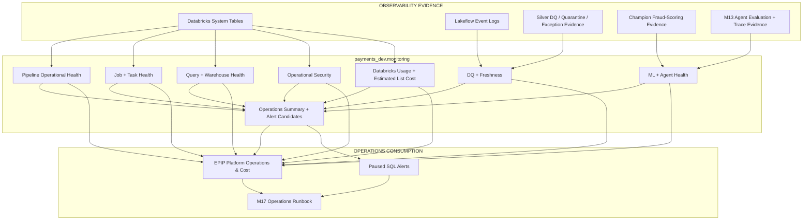

# EPIP Monitoring, Observability and Cost Architecture

## Status

```text
Milestone 17 — FINAL EPIP MILESTONE
M17A — COMPLETE
M17B — COMPLETE
M17C — COMPLETE
M17D — COMPLETE after final validation and merge
```

M17D consolidates the remaining observability, ML/AI monitoring, FinOps,
dashboard, alerting and project-closeout work into the final EPIP milestone.

---

# Objective

EPIP observability answers five operational questions:

1. Is the data platform healthy?
2. Is trusted data still trustworthy and fresh?
3. Are jobs, SQL queries and warehouses operating efficiently?
4. Are fraud-model and agent outputs backed by current governed evidence?
5. Where is Databricks usage and estimated list cost being consumed?

The architecture reuses platform-native evidence instead of introducing a
separate always-on monitoring stack.

---

# Architecture



---

# 1. Monitoring Schema

The governed monitoring contract is:

```text
payments_dev.monitoring
```

This schema separates operational consumption from the underlying raw platform
metadata.

The design principle is:

```text
account / workspace operational evidence
                ↓
        curated monitoring views
                ↓
        approved operational use
```

Consumers do not need unrestricted access to every raw System Table in order to
use the final operational views.

---

# 2. Databricks-Native Evidence

## Billing

```text
system.billing.usage
system.billing.list_prices
system.billing.attributed_usage
system.billing.account_prices
```

M17D uses `usage` and `list_prices` for corrected usage and list-price
estimation.

## Lakeflow

```text
system.lakeflow.jobs
system.lakeflow.job_tasks
system.lakeflow.job_run_timeline
system.lakeflow.job_task_run_timeline
system.lakeflow.pipelines
system.lakeflow.pipeline_update_timeline
```

Pipeline and job definition tables are treated as SCD2 sources.

Long timeline executions are normalized into one logical run or update.

## Query

```text
system.query.history
```

Monitored signals include:

- status
- total duration
- execution duration
- compute wait
- capacity wait
- files read
- files pruned
- bytes read
- result-cache usage
- local spill
- shuffle reads
- query source / job attribution

## Compute

```text
system.compute.warehouses
system.compute.warehouse_events
```

The final dashboard monitors:

- warehouse size
- min/max clusters
- auto-stop
- latest lifecycle event
- latest cluster count

## Access / Audit

```text
system.access.audit
```

The curated monitoring view deliberately does not expose raw source IP addresses
or raw request parameters.

Request metadata is used only to identify EPIP-related activity before the
curated projection is produced.

---

# 3. Pipeline and Data-Quality Monitoring

Implemented views include:

```text
current_epip_pipelines
epip_pipeline_update_health
pipeline_operational_health

lakeflow_expectation_metrics
dq_quarantine_daily
dq_quarantine_rule_metrics
dq_current_health

payment_event_exception_health
data_freshness_health
```

## Explicit NEVER_RUN state

A pipeline definition must not disappear merely because it has no update
history.

The monitoring contract therefore represents:

```text
definition exists + no update
        ↓
NEVER_RUN
```

## Explicit zero-quarantine state

Historical quarantine views naturally contain no rows when nothing has failed.

For dashboard use, `dq_current_health` explicitly represents:

```text
payment_events          0 quarantined → HEALTHY
payment_transactions    0 quarantined → HEALTHY
```

This distinguishes a healthy zero-failure state from missing monitoring
evidence.

## Business time versus processing time

EPIP uses deterministic synthetic historical payment timestamps.

Therefore freshness separates:

```text
latest_business_time
```

from:

```text
latest_observed_at
```

Operational freshness is based on processing/trust evidence, not merely on the
age of synthetic business events.

---

# 4. Job and Task Monitoring

Implemented views:

```text
current_epip_jobs
current_epip_job_tasks
epip_job_run_health
epip_job_task_run_health
job_operational_health
job_daily_health
```

The same principles used for pipelines apply to jobs:

```text
current job + no run history
        ↓
NEVER_RUN
```

Task monitoring makes failed downstream steps visible even when the job-level
summary alone is insufficient for diagnosis.

Long job/task timelines can be emitted as multiple time slices, so M17D
aggregates them back into logical runs before calculating duration and status.

---

# 5. Query and Warehouse Monitoring

Implemented views:

```text
epip_query_performance
query_performance_daily
warehouse_operational_health
```

## Query attribution

System query history can cover more than EPIP.

M17D attributes a query when:

1. it was launched by a current EPIP job; or
2. its visible SQL text references EPIP/payment catalogs.

This is intentionally conservative.

If statement text is redacted by platform privileges, job-based attribution can
still work.

## Query indicators

The portfolio implementation surfaces evidence such as:

```text
FAILED
SPILLING
QUEUE_DELAY
LONG_RUNNING
HIGH_SCAN
HEALTHY
```

The thresholds are demonstration heuristics, not universal financial-services
SLAs.

They are intended to point an engineer toward Query Profile and workload
diagnosis, not to prescribe an automatic remediation.

---

# 6. Operational Security Monitoring

Implemented views:

```text
epip_security_events
security_event_daily
```

M17D focuses on operationally useful EPIP-related activity:

- failed operations
- governance changes
- resource changes
- service-principal / run-as activity where identifiable
- selected Unity Catalog activity

The monitoring layer deliberately avoids turning the operations dashboard into
a raw audit-log browser.

---

# 7. Fraud-Model Monitoring

Implemented view:

```text
fraud_model_current_health
```

The source is governed Champion scoring evidence already exposed through the
EPIP analytics layer.

Metrics include:

- model name
- model version
- Champion alias
- latest scoring timestamp
- transactions scored
- average fraud probability
- predicted-fraud rate
- high-risk rate
- scoring freshness

Important semantic rule:

```text
predicted_fraud != confirmed fraud
fraud_probability != proof of fraud
```

Historical AP, F2, recall, precision and threshold evaluation remain governed
MLflow training/evaluation evidence.

M17D does not invent SQL history for metrics that were not separately persisted
as Delta tables.

---

# 8. Agent Monitoring

Implemented views:

```text
agent_evaluation_health
agent_latest_health
agent_failed_case_diagnostics
```

The source is the M13 persisted golden-evaluation evidence.

Metrics include:

- case pass rate
- groundedness
- evidence completeness
- tool selection
- tool arguments
- tool efficiency
- citation quality
- scope compliance
- human-review compliance
- safety
- duration
- failed gates

Failed cases preserve:

```text
trace_id
```

which supports the diagnostic path:

```text
Regression failure
      ↓
Failed evaluation case
      ↓
trace_id
      ↓
MLflow trace
      ↓
tool / retrieval / generation diagnosis
```

---

# 9. Databricks Cost Attribution

Implemented views:

```text
databricks_usage_cost_detail
databricks_cost_daily
databricks_cost_by_sku
databricks_cost_by_workload
cost_optimisation_candidates
```

## Billing correction semantics

Databricks usage can contain:

```text
ORIGINAL
RETRACTION
RESTATEMENT
```

M17D does not filter only `ORIGINAL`.

Usage and cost are summed so correction rows can produce the corrected total.

## Price semantics

Estimated list cost uses the effective list price applicable at usage time.

The result is:

```text
Databricks estimated list cost
```

It is not presented as the final contracted invoice.

## Attribution

Where usage metadata supports it, cost is attributed to:

```text
JOB
LAKEFLOW_PIPELINE
SQL_WAREHOUSE
ENDPOINT
NOTEBOOK
OTHER
```

Attribution quality is also exposed so a dashboard user can distinguish directly
identified EPIP resources from broader workspace-level attribution.

---

# 10. Cost Optimisation

The final monitoring layer surfaces evidence-based optimisation candidates.

Examples:

```text
failed job cost
top-cost workloads
warehouse auto-stop review
query spill
query queue delay
large scans
poor file pruning
```

M17D does not automatically resize infrastructure based on these heuristics.

The intended engineering loop is:

```text
observe
  ↓
identify hotspot
  ↓
inspect workload / Query Profile / run evidence
  ↓
change one design or compute variable
  ↓
measure again
```

---

# 11. AWS Cost Boundary

The dashboard covers Databricks platform usage and estimated Databricks list
cost.

It does not represent the complete AWS invoice.

Specifically, without a separate AWS billing integration it does not claim
complete coverage for:

```text
Amazon MSK
Amazon S3
AWS data transfer
other AWS infrastructure
taxes / negotiated discounts / credits
```

A future AWS CUR or Cost Explorer integration could extend the architecture, but
it is intentionally not claimed as part of EPIP.

---

# 12. Final Operations Dashboard

Dashboard:

```text
EPIP Platform Operations & Cost
```

Pages:

1. Platform Health
2. Data Quality & Security
3. ML & Agent Health
4. Cost & Performance

The operations dashboard remains separate from the business dashboard:

```text
EPIP Payments Intelligence
```

This is intentional.

Business analytics and platform operations have different consumers, semantic
contracts and operational responsibilities.

---

# 13. Alerts

Version-controlled paused alert resources:

```text
EPIP - Pipeline Failure
EPIP - Data Freshness
EPIP - DQ Degradation
EPIP - Agent Regression
EPIP - Databricks Cost Anomaly
```

Alerts are deployed in `PAUSED` state by default.

Reasons:

- avoid unnecessary warehouse starts during portfolio development
- prevent alert noise
- require explicit operational ownership before activation
- preserve cost control

No notification destination is invented.

The user can later configure approved destinations and unpause only the alerts
they want to demonstrate.

---

# 14. Final M17 Architecture

```text
Data / Lakeflow / Query / Compute / Audit / ML / Agent / Billing evidence
                                ↓
                     payments_dev.monitoring
                                ↓
       ┌─────────────┬──────────┼──────────┬──────────────┐
       ▼             ▼          ▼          ▼              ▼
   Pipeline/DQ    Jobs/Tasks   Queries   ML/Agent       Cost/Security
       └─────────────┴──────────┼──────────┴──────────────┘
                                ▼
                 Platform Operations Summary
                                ↓
               EPIP Platform Operations & Cost
                                +
                     Paused SQL Alerts
```

---

# 15. Definition of Done

M17 is complete when:

```text
[ ] M17D SQL views create successfully
[ ] M17 final validation SQL runs successfully
[ ] dashboard resource validates
[ ] paused alert resources validate
[ ] development bundle deploy succeeds
[ ] contract tests pass
[ ] full pytest passes
[ ] Ruff passes
[ ] mypy passes
[ ] package build passes
[ ] dev bundle validate/plan passes
[ ] CI bundle validate/plan passes
[ ] README marks M1-M17 complete
[ ] PROJECT_STATUS marks M1-M17 complete
[ ] platform architecture describes observability as implemented
[ ] the obsolete future-milestone entry is removed
[ ] final PR is merged
```

After the final M17D merge, EPIP is a completed portfolio project rather than a
project with another planned milestone.
