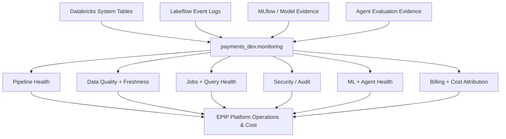

# EPIP Monitoring, Observability and Cost Architecture

## Status

```text
Milestone 17 — IN PROGRESS
Current step — M17B Observability Foundation
```

## Objective

M17 adds operational visibility to the already implemented EPIP data, ML, AI,
analytics, governance and CI/CD platform.

The design is deliberately evidence-first:

```text
Platform telemetry
      ↓
Governed monitoring views
      ↓
Operational interpretation
      ↓
Dashboard / alert / optimisation decision
```

EPIP does not add custom logging when Databricks already exposes the required
operational evidence through system tables or Lakeflow event logs.

---

## Confirmed Databricks System-Table Inventory

The EPIP AWS workspace exposes the following relevant schemas and tables.

### Billing

```text
system.billing.account_prices
system.billing.attributed_usage
system.billing.list_prices
system.billing.usage
```

### Lakeflow

```text
system.lakeflow.jobs
system.lakeflow.job_tasks
system.lakeflow.job_run_timeline
system.lakeflow.job_task_run_timeline
system.lakeflow.pipelines
system.lakeflow.pipeline_update_timeline
system.lakeflow.zerobus_ingest
system.lakeflow.zerobus_stream
```

### Query

```text
system.query.history
```

### Compute

```text
system.compute.clusters
system.compute.instance_events
system.compute.instance_pools
system.compute.node_timeline
system.compute.node_types
system.compute.warehouse_events
system.compute.warehouses
```

### Access

```text
system.access.audit
system.access.column_lineage
system.access.table_lineage
system.access.workspaces_latest
system.access.inbound_network
system.access.outbound_network
system.access.assistant_events
system.access.clean_room_events
```

---

## M17 Architecture



---

## M17B Foundation

M17B does not attempt to implement the entire monitoring platform.

It establishes the governed monitoring contract using:

```text
system.lakeflow.pipelines
system.lakeflow.pipeline_update_timeline
system.lakeflow.jobs
system.lakeflow.job_run_timeline
system.query.history
system.billing.usage
system.access.audit
```

The first four become operational EPIP views. Query, billing and audit are
initially represented in source-readiness checks and are expanded later.

### Created monitoring views

```text
payments_dev.monitoring.current_epip_pipelines
payments_dev.monitoring.epip_pipeline_update_health
payments_dev.monitoring.current_epip_jobs
payments_dev.monitoring.epip_job_run_health
payments_dev.monitoring.system_source_readiness
```

---

## Why SCD2 Handling Matters

`system.lakeflow.pipelines` and `system.lakeflow.jobs` are slowly changing
dimension tables.

Therefore this is incorrect:

```text
filter deleted rows
then choose latest row
```

because it can accidentally expose the last pre-deletion version.

EPIP instead uses:

```text
all history
    ↓
ROW_NUMBER by object key
ORDER BY change_time DESC
    ↓
keep latest row
    ↓
then exclude delete_time
```

This is the same kind of temporal correctness principle used elsewhere in EPIP.

---

## Why Timeline Aggregation Matters

Lakeflow job and pipeline timeline tables can split long-running executions into
hourly slices.

Therefore:

```text
one row != always one logical run
```

M17B groups slices back to:

```text
pipeline_id + update_id
```

or:

```text
job_id + run_id
```

before calculating duration and health.

This prevents long executions from being double-counted in later dashboards.

---

## Current Health Semantics

Pipeline result states:

```text
COMPLETED
FAILED
CANCELED
```

EPIP maps them to:

```text
COMPLETED → HEALTHY
FAILED    → ATTENTION
CANCELED  → ATTENTION
NULL      → IN_PROGRESS_OR_INCOMPLETE
```

Job result states are similarly normalized while preserving the raw Databricks
result state and termination code.

The normalized health label is a dashboard convenience. The raw system-table
state remains available for troubleshooting.

---

## Source Availability Semantics

Not every system table has identical delivery timing or scope.

Examples:

```text
billing usage
    → account-global billing evidence
    → can arrive later than operational telemetry

Lakeflow / query / audit
    → regional operational evidence
```

For this reason `system_source_readiness.latest_event_time` is informational.

M17B does not apply a single universal freshness SLA to all Databricks system
tables.

---

## Scope Boundaries

### M17B

```text
schema
system-table inventory
current pipelines
pipeline update health
current jobs
job-run health
source readiness
```

### M17C

```text
Lakeflow event logs
expectations
quarantine
late events
data freshness
DQ trends
```

### M17D

```text
job task health
query performance
warehouse health
audit/security events
```

### M17E

```text
fraud model health
MLflow operational evidence
agent quality
agent traces
```

### M17F

```text
billing usage
list prices
attributed usage
cost estimation
cost attribution
optimisation indicators
```

### M17G

```text
EPIP Platform Operations & Cost dashboard
alerts
```

---

## Cost Boundary

M17 monitors Databricks platform usage and cost.

Databricks billing system tables do not represent EPIP's complete AWS invoice.

Therefore M17 does not claim complete cost coverage for:

```text
Amazon MSK
Amazon S3
AWS network/data-transfer charges
other AWS services
```

unless a separate AWS billing source is implemented.

---

## Security

Raw system tables contain account-wide operational metadata.

Monitoring consumers should not automatically receive direct access to the
underlying system schemas.

The preferred long-term pattern is:

```text
restricted system tables
        ↓
curated payments_dev.monitoring views
        ↓
approved platform/operations consumers
```

Later M17 stages can add explicit RBAC for the monitoring schema once the final
consumer personas are defined.

---

## M17B Definition of Done

```text
[ ] monitoring schema bundle resource validates
[ ] payments_dev.monitoring exists
[ ] system-table inventory captured
[ ] current EPIP pipeline view created
[ ] pipeline update health view created
[ ] current EPIP job view created
[ ] job-run health view created
[ ] source-readiness view created
[ ] validation SQL passes
[ ] unit tests pass
[ ] bundle validation passes
[ ] PR merged
```
