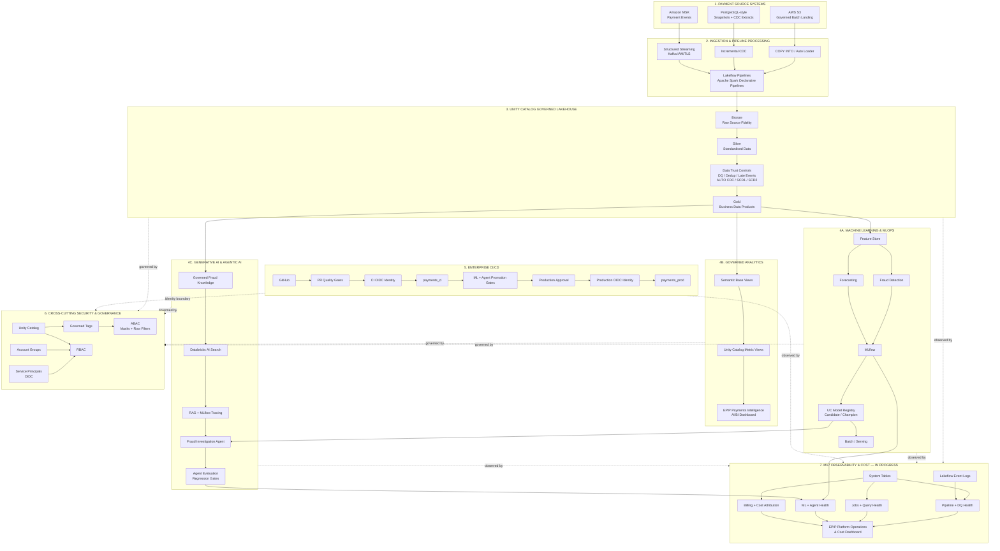
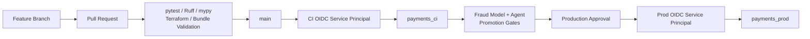
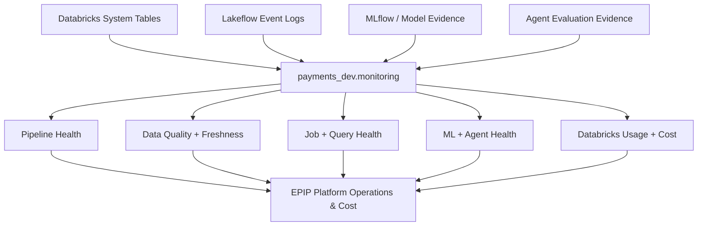

# Enterprise Payments Intelligence Platform Architecture

## Purpose

This document describes the **implemented architecture** of the Enterprise Payments
Intelligence Platform (EPIP) and the architectural direction of the active milestone.

It is intentionally maintained as an implementation document rather than a hypothetical
future-state diagram.

The architecture must not claim infrastructure or platform capabilities that the project
has not actually implemented.

---

# Current State

```text
Completed: M1–M16
Active:    M17 Monitoring, Observability and Cost Optimisation
Future:    M18 Azure Portability
```

Primary platform:

```text
AWS
+
Databricks
```

Primary Databricks region:

```text
ap-southeast-2
```

---

# Architecture Goals

EPIP is designed to demonstrate a production-style payments data platform supporting:

- governed batch ingestion
- real-time payment-event ingestion
- Medallion architecture
- data quality
- CDC
- SCD Type 1
- SCD Type 2
- streaming deduplication
- late/out-of-order event handling
- analytical data products
- feature engineering
- fraud detection
- payment forecasting
- MLOps
- RAG
- AI Search
- agentic fraud investigation
- agent evaluation
- governed semantic analytics
- AI/BI dashboards
- enterprise CI/CD
- RBAC
- ABAC
- governed data classification
- PII masking
- row-level jurisdictional security
- operational observability
- cost attribution and optimisation

---

# Architecture Overview

The platform should be understood as a set of **parallel governed workloads** built on a
shared Lakehouse foundation.



---

# 1. Source Systems

EPIP currently demonstrates three source patterns.

## AWS S3 batch landing

The Terraform implementation creates the governed S3 landing foundation used by batch
ingestion.

Implemented controls include:

- S3 bucket
- block public access
- bucket-owner-enforced ownership
- AES-256 server-side encryption
- versioning
- lifecycle hygiene
- governed landing prefix
- Unity Catalog IAM role
- least-privilege access policy

The architecture therefore treats S3 as a real deployed external source/storage boundary.

## PostgreSQL-style source extracts

EPIP generates deterministic source-system data that represents:

- snapshots
- incremental changes
- CDC-style master-data changes

The project does **not** claim a deployed production PostgreSQL/RDS instance.

The correct architecture wording is:

```text
PostgreSQL-style snapshots and CDC extracts
```

rather than:

```text
Amazon RDS / production PostgreSQL
```

## Amazon MSK

The streaming implementation uses Amazon MSK for payment events.

Implemented characteristics include:

- Kafka-compatible payment topic
- IAM authentication
- TLS
- Terraform-managed MSK/networking components
- deterministic publisher
- duplicate delivery scenarios
- late events
- out-of-order events

---

# 2. Ingestion and Pipeline Processing

EPIP uses several ingestion patterns because different sources require different semantics.

```text
S3 / files
    → COPY INTO / Auto Loader

PostgreSQL-style extracts
    → snapshot / incremental CDC ingestion

Amazon MSK
    → Structured Streaming
    → Unity Catalog service credential
```

Transformation and ingestion code is orchestrated through **Lakeflow pipelines built on
Apache Spark Declarative Pipelines**.

Lakeflow extends the declarative pipeline model with Databricks production capabilities
used by EPIP, including:

- streaming tables
- declarative flows
- AUTO CDC
- data-quality expectations
- queryable pipeline event logs

---

# 3. Medallion Lakehouse

## Bronze

Purpose:

- preserve source fidelity
- retain physical event lineage
- retain Kafka metadata
- support replay and audit

Streaming Bronze preserves information such as:

```text
topic
partition
offset
Kafka timestamp
source event payload
ingestion timestamp
```

A core design principle is:

> A physical Kafka delivery is not automatically a unique financial transaction.

This distinction allows EPIP to demonstrate duplicate-delivery handling without
incorrectly counting duplicated messages as independent financial transactions.

## Silver

Silver is the trust and standardisation layer.

Capabilities include:

- schema standardisation
- type normalisation
- event-time processing
- deduplication
- late-event policy
- out-of-order auditing
- expectations
- validated/quarantine paths
- master-data CDC
- AUTO CDC
- SCD Type 1
- SCD Type 2
- deletes
- business-key sequencing
- current-state dimension enrichment

## Gold

Gold exposes business-ready payment data products used by:

- analytics
- feature engineering
- fraud detection
- forecasting
- fraud knowledge/evidence preparation

The downstream ML, analytics, and AI branches should therefore be viewed as parallel
consumers of governed Lakehouse products rather than sequential stages.

---

# 4A. Machine Learning and MLOps

## Feature Store

EPIP implements governed Feature Store assets including:

```text
payments_dev.features.transaction_fraud_features
payments_dev.features.customer_behavior_features
payments_dev.features.merchant_behavior_features
```

Feature engineering emphasizes:

- transaction-grain features
- point-in-time correctness
- windows ending before the current transaction
- leakage prevention
- TIMESERIES primary keys

## Fraud detection

Models include:

- logistic-regression baseline
- gradient-boosted challenger

Evaluation includes:

- temporal validation
- class-imbalance treatment
- threshold optimisation
- fraud-focused metrics

The platform intentionally distinguishes:

```text
model risk prediction
```

from:

```text
confirmed fraud outcome
```

## Forecasting

The forecasting branch includes:

- seasonal baseline
- Ridge
- gradient boosting
- lag features
- rolling features
- recursive forecasting
- temporal validation

## MLflow and Unity Catalog Model Registry

Model lifecycle:

```text
Training
   ↓
MLflow Run
   ↓
Selected Model
   ↓
Unity Catalog Registered Model
   ↓
Candidate
   ↓
Validation Gates
   ↓
Champion
   ↓
Batch / Serving
```

Rollback support retains previous Champion context.

---

# 4B. Governed Analytics

The analytics architecture centralizes business definitions rather than allowing each
dashboard to redefine KPIs.

```text
Gold / ML / Agent Evaluation
             ↓
      Semantic Base Views
             ↓
  Unity Catalog Metric Views
             ↓
       MEASURE(...)
             ↓
EPIP Payments Intelligence
      AI/BI Dashboard
```

The existing business dashboard includes:

1. Executive Payments
2. Fraud Intelligence
3. Fraud Agent Quality

This is intentionally separate from the M17 platform-operations dashboard.

---

# 4C. Generative AI and Agentic AI

## Governed RAG

Architecture:

```text
User / Investigator Question
             ↓
       Databricks AI Search
             ↓
       HYBRID Retrieval
             ↓
     Governed Knowledge Chunks
             ↓
        Claude Generation
             ↓
       MLflow GenAI Trace
```

## Fraud Investigation Agent

The agent combines:

- transaction context
- behavioural evidence
- Champion model signals
- fraud knowledge retrieval
- approved read-only tools
- MLflow tracing

Approved tools:

```text
get_transaction_context
get_fraud_evidence
search_fraud_knowledge
```

The agent cannot:

- confirm fraud
- decline a payment
- block a card
- freeze an account
- execute arbitrary SQL
- perform unrestricted state changes

Human review remains mandatory.

## Agent evaluation

Evaluation combines deterministic and LLM-judge scoring.

Critical controls include:

```text
transaction scope
safety
human review
response structure
```

The evaluation layer is connected to CI/CD promotion so a degraded agent cannot silently
move forward.

---

# 5. Enterprise CI/CD

The release architecture separates validation, CI deployment, promotion evidence, and
production approval.



Important boundaries:

- pull requests validate but do not directly deploy production
- CI uses a dedicated service principal
- production uses a different service principal
- OIDC eliminates stored Databricks CI/CD credentials
- model lifecycle evidence is checked before release
- agent regression evidence is checked before release
- production requires approval

---

# 6. Security and Governance

Unity Catalog is the core data/AI governance layer.

The M16 architecture combines:

```text
Identity
  +
RBAC
  +
Governed Tags
  +
ABAC
```

## Human identities

Account-level groups:

```text
epip-platform-admins
epip-data-engineers
epip-ml-engineers
epip-fraud-analysts
epip-fraud-analysts-au
epip-bi-consumers
```

## Automation identities

```text
epip-github-actions-ci
epip-github-actions-prod
```

## RBAC

RBAC answers:

> Can this principal access the securable object?

## Governed tags

EPIP uses:

```text
epip_classification
epip_pii
epip_region_key
```

## ABAC

ABAC answers:

> If access is already granted, what rows and column values can the principal see?

Initial protected table:

```text
payments_dev.silver.customers_current
```

Example:

```text
customers_current
    epip_classification = restricted

email
    epip_pii = email
       ↓
email masking policy

country
    epip_region_key = country
       ↓
AU row-filter policy
```

The AU fraud analyst persona demonstrates:

```text
country = AU
```

as a jurisdictional access rule.

---

# 7. M17 Monitoring and Cost Architecture

M17 introduces observability as another cross-cutting platform capability.

The design intentionally starts with Databricks-native sources.



## Planned monitoring domains

### Pipeline health

- last update
- successful/failed updates
- duration
- records processed
- pipeline state
- error context

### Data quality

- expectation failures
- pass/failure trends
- quarantine volume
- late-event trends
- freshness lag

### Jobs and query operations

- run success/failure
- duration
- failed tasks
- slow/failed queries
- high-scan queries where supported

### ML

- Champion version
- scoring freshness
- prediction distribution
- quality/evaluation history

### Agent

- evaluation pass rate
- groundedness
- evidence completeness
- tool quality
- citation quality
- safety
- human-review compliance
- duration
- MLflow trace linkage

### Cost

M17 will initially focus on Databricks-native billing/usage visibility.

Planned views include:

```text
daily Databricks cost
cost by SKU
cost by workload/resource where metadata supports attribution
cost trends
high-cost failures
performance/cost relationships
```

## AWS cost boundary

Databricks System Tables do not represent the complete AWS invoice.

Therefore the M17 architecture will not claim full cost coverage for:

- Amazon MSK
- Amazon S3
- AWS data transfer
- other AWS infrastructure

unless an AWS cost source such as CUR or Cost Explorer is explicitly integrated.

---

# Infrastructure Responsibility Boundaries

## Terraform

Terraform currently manages AWS infrastructure including:

- S3 landing storage
- S3 security/lifecycle controls
- Unity Catalog IAM trust and S3 access
- Amazon MSK
- MSK IAM
- MSK networking/security configuration

Terraform does not imply that every possible enterprise AWS component exists.

## Declarative Automation Bundles

Bundles manage Databricks application resources such as:

- schemas
- Lakeflow pipelines
- jobs
- analytics resources
- dashboard resources
- deployment targets

The root bundle automatically includes:

```text
bundle/resources/*.yml
```

which allows new milestone resources to join the existing deployment model.

## GitHub Actions

GitHub Actions provides:

- code quality gates
- package validation
- Terraform validation
- bundle validation
- OIDC authentication
- controlled Databricks deployment
- model promotion gates
- agent promotion gates
- production release control

---

# Serverless-First Strategy

The development implementation is serverless-first where supported.

Reasons:

- simpler portfolio operations
- fast provisioning
- reduced idle infrastructure
- cost-conscious development
- compatibility with modern Unity Catalog security controls

For streaming, EPIP uses triggered processing rather than an always-running continuous
Kafka pipeline in the portfolio environment.

The architecture is production-oriented, but the demonstration environment intentionally
balances realism with cost.

---

# Development GenAI Runtime

The development environment uses a hybrid GenAI execution model because direct outbound
access from the current Databricks serverless environment to external model APIs is
restricted.

```text
Local Python
    │
    ├── Claude
    ├── OpenAI Judge
    └── Agent / Evaluation orchestration
    │
    ▼
Databricks
    ├── Unity Catalog
    ├── SQL Warehouse
    ├── Feature Store
    ├── Fraud Predictions
    ├── AI Search
    ├── MLflow
    └── Delta Evidence / Evaluation
```

This is an environment constraint, not an architectural requirement.

---

# Environment Boundaries

```text
Development
payments_dev
    │
    ├── engineering
    ├── ML/AI development
    └── analytics development

CI
payments_ci
    │
    └── automated controlled deployment

Production-style
payments_prod
    │
    └── approval-controlled production bundle
```

Identity boundaries:

```text
Human users
    → account groups

CI automation
    → CI service principal + OIDC

Production automation
    → Production service principal + OIDC
```

---

# Architecture Decisions

## No production RDS claim

EPIP uses PostgreSQL-style source extracts but does not claim a production RDS deployment.

## No AWS DMS claim

CDC is demonstrated through deterministic source extracts and Lakeflow CDC processing.
AWS DMS is not part of the deployed architecture.

## No VPC endpoint claim

The architecture does not claim VPC endpoints that have not been deployed.

## Triggered streaming for portfolio cost control

The payment-events pipeline demonstrates real Kafka/MSK ingestion but is not kept
continuously active.

## Separate business and operations dashboards

```text
EPIP Payments Intelligence
    → business / fraud / agent quality consumers

EPIP Platform Operations & Cost
    → platform / engineering / operations consumers
```

## Governance is cross-cutting

Unity Catalog governance is not a final pipeline stage. It applies across data, analytics,
ML, AI, and operational assets.

## Observability is cross-cutting

M17 monitoring is not downstream reporting only. It observes the operational behaviour
of the platform itself.

---

# Architecture Evolution

Completed architecture:

```text
M1–M16
```

Active architectural enhancement:

```text
M17 — Monitoring, Observability and Cost Optimisation
```

Future portability work:

```text
M18 — Azure Portability
```

This document must continue to represent what EPIP actually implements rather than
silently drifting into an aspirational enterprise diagram.
